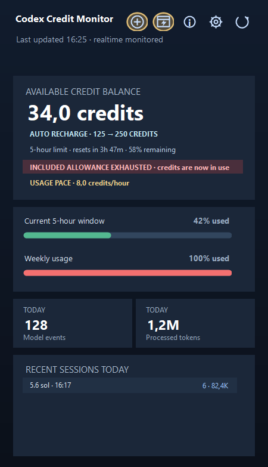

# Codex Credit Monitor

A lightweight Windows system-tray companion that turns local Codex session data into a clear, practical usage dashboard.

## Why use it?

Codex usage information is useful, but it is easy to lose sight of your active allowance while working. Codex Credit Monitor keeps the most relevant signals close at hand so you can decide when to continue, slow down, add credits, or wait for a reset.

At a glance, you can see:

- Your available credit balance.
- Usage in the current 5-hour window and the weekly window.
- How long remains until the 5-hour window resets.
- The allowance still remaining in that window.
- Today's model activity, processed tokens, and recent sessions.
- Whether credits are being consumed unusually quickly.

## How it works

The application runs quietly in the Windows system tray. It reads local Codex session records for the signed-in Windows user and summarizes them in a compact dashboard. New local session activity can trigger an update, and you can also refresh manually or use a configurable refresh interval.

No account credentials are requested. No usage data is uploaded, and the application does not call a billing service. It is an independent local monitor, not an official OpenAI billing meter.

## Dashboard

The dashboard combines credits, allowances, today's activity, recent sessions, and locally observed credit-use pace without crowding the layout.

## Contextual credit actions

- **Add credits** appears when the available balance is 50 credits or lower.
- **Use credits** appears when the included weekly allowance is exhausted and a positive credit balance is available.

Both actions open ChatGPT Usage & Billing. Codex Credit Monitor never purchases credits or changes ChatGPT settings by itself.

## Alerts

Optional local notifications cover 75% and 90% 5-hour-window usage, low credit balances, and unusually rapid credit use. Notifications use the same usage and balance values shown on the dashboard.

## PortableApps.com Platform support

Codex Credit Monitor v2.2 is a portable application that has been tested successfully inside the PortableApps.com Platform.

For PortableApps users this means:

- Start it from the PortableApps.com menu as **Codex Credit Monitor Portable**.
- Keep the complete application folder together when moving it between drives or computers.
- Store application settings inside the package's own Data folder.
- Run without installing a separate .NET Desktop Runtime.
- Leave no permanent Windows startup entry when using the portable edition.

The package follows the PortableApps directory structure and includes its launcher, AppInfo metadata, application icon, and self-contained 64-bit Windows runtime.

## Settings and controls

From the system tray you can open the dashboard, refresh immediately, change settings, view product information, or exit. Settings include language, alerts, sound, refresh interval, and — for the standard Windows build — launch at Windows sign-in.

The Info window contains the current product description in Dutch or English. It scrolls gently and pauses when you point at the text.

## Download

Download the current package from the [latest release](https://github.com/sibosays/CodexCreditMonitor/releases/latest):

1. Download CodexCreditMonitorPortable_2.2.zip.
2. Extract the complete ZIP archive.
3. Open the extracted CodexCreditMonitorPortable folder.
4. Run CodexCreditMonitorPortable.exe directly or add it to the PortableApps.com Platform.

## Verify the download

Use SHA256SUMS.txt to verify the Portable ZIP. The current release contains the application package, checksum, and matching dashboard screenshot, in addition to GitHub's automatic source archives.

## Privacy and scope

Codex Credit Monitor reads local Codex session records only and sends no data anywhere. Cloud tasks, other devices, and delayed account updates may differ until those values are written locally.

## What is new in v2.2?

- Real 5-hour reset countdown and remaining allowance in the dashboard status area.
- A professional product-focused Info view instead of change history.
- Gentle automatic Info scrolling with pause-on-hover behavior.
- Self-contained Windows and PortableApps delivery without a separate .NET dependency.

---

Concept and development: **C.S.K. (Simon) Bouwens**  
© 2026 C.S.K. (Simon) Bouwens · Built with AI assistance